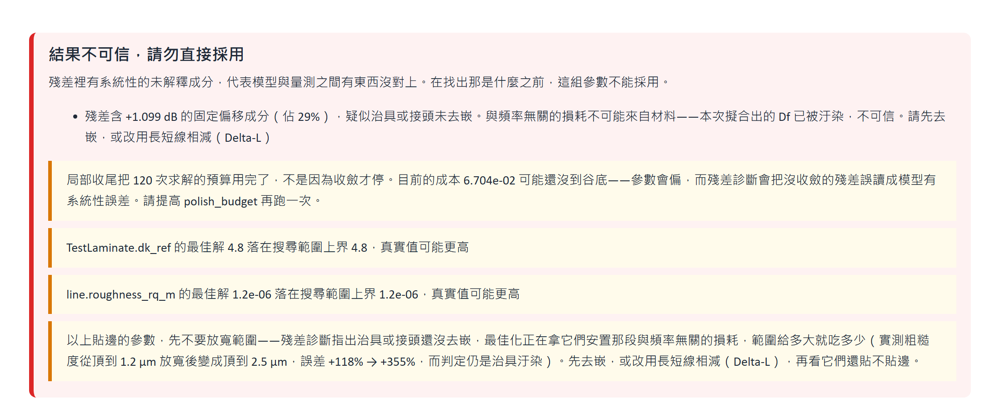
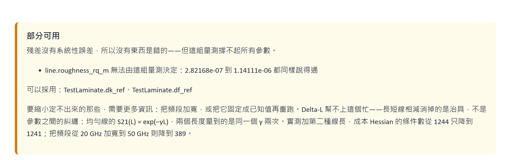

# Simulation vs. Measurement Calibration Toolkit

Compare simulated and measured S-parameters, find the material parameters that make the
simulation match the measurement, and — this is the point — **decide whether that answer
can be trusted**.

Language: [繁體中文](README.zh-TW.md)｜[English](README.en.md)｜[Operation guide](docs/operation-en.md)｜[Validation](docs/validation.md)

---

## What this tool guards against

Engineers routinely hold a simulated and a measured S-parameter set that do not agree.
The usual response is to guess: Dk was too low, Df was too high, change it and solve again.
Days go by, and the result does not carry over to the next project.

Automating that search is not the hard part. **The hard part is knowing whether the
automated answer is right.**

Any fit with enough free parameters can be made to overlay the curve. The classic failure
looks like this:

> The measurement includes SMA connectors and launches; the simulation is the trace only.
> Insertion loss differs by 0.8 dB. The optimizer faithfully pushes Df from 0.008 to 0.019
> until the curves overlay.
> **The overlay is perfect, the cost function reports great success, and Df is wrong.**
> Nothing raises an error, because by that cost function's own measure it did well.

That Df then propagates into the next project. Every layer of this tool exists to stop it.

---

## Four guards

| Guard | What it catches |
|---|---|
| **Pre-flight checks** | Port count, port order, reference impedance, band overlap, passivity, reciprocity, low-frequency insertion-loss offset |
| **Magnitude and group delay together** | Fitting magnitude alone leaves phase information out of the judgement entirely |
| **Residual shape diagnosis** | Whether the curves overlay tells you nothing; the **shape** of the residual tells you whether they overlay for the right reason |
| **Identifiability analysis** | A clean residual does not mean the parameters are right. Measured case: Df wrong by 34% with a residual of only 0.046 dB |

Residual shape maps onto physics directly:

| Residual shape | Meaning |
|---|---|
| Near-flat dB offset | Fixture or connector not de-embedded; Df is already contaminated |
| Proportional to f | Dielectric loss still unmatched |
| Proportional to √f | Conductor loss or roughness still unmatched |
| Not a smooth shape | Resonance or impedance discontinuity — not a material problem |

---

## Three verdicts, not two

| Verdict | Meaning |
|---|---|
| **Trustworthy** | No systematic error in the residual, and every parameter is identifiable |
| **Partially usable** | Nothing is wrong, but this measurement cannot support all the parameters — the report lists which ones may be adopted |
| **Not trustworthy** | The residual contains a systematic unexplained component; something between model and measurement does not line up |

Collapsing the last two into one makes users throw away the good parameters along with the
bad.

Here is what the three look like in the report. Every image below is real tool output; the
numbers line up with the three scenarios in the [validation report](docs/validation.md).



The run with the fixture still in. The tool does not report the contaminated Df, and it
**declines to give the standard "widen the search range" advice** — with the fixture still
there, widening only lets that parameter absorb more of it.



After Delta-L. Nothing is wrong, but this measurement cannot support three degrees of
freedom. It names the two that may be adopted, and explains why Delta-L does not help here.


The exported material library carries this verdict with it. **A fixture-contaminated Df
that reaches the next project unlabelled turns this tool into the carrier of the
contamination rather than the guard against it.**

---

## Delta-L: removing the fixture

Measure a pair of coupons with the same cross-section and different lengths. Dividing one
by the other cancels the fixture and connectors exactly — no de-embedding algorithm, no
2x-thru:

```
S21(long) / S21(short) = F1·exp(−γL2)·F2 / (F1·exp(−γL1)·F2) = exp(−γ·ΔL)
```

Measured difference, on one data set carrying 0.6 dB of connector loss:

| | Dk | Df | Diagnosis |
|---|---|---|---|
| Calibrate the long line directly | +10.6% | +18.9% | Fixture contamination, not trustworthy |
| Via Delta-L | +0.02% | +0.56% | Clean, trustworthy |

Three things are checked for you: a wrong length unit (effective permittivity is recovered
from group delay and rejected outside 1–20), inconsistent fixtures (loss difference
extrapolated to DC still has a residue), and too coarse a frequency sample (under phase
aliasing you cannot even tell which coupon is the long one).

After the division **only S21 is physical**. Putting S11 in a calibration band is rejected
outright — otherwise the optimizer fits a column of zeros and reports perfect convergence.

### Delta-L does not fix "this parameter is not identifiable"

For a uniform line S21(L) = exp(−γL), so two lengths measure **the same γ twice** rather
than giving two independent equations. Computing the Hessian of the exact cost at the true
values directly:

| Measurement configuration | Condition number |
|---|---|
| 1–20 GHz, one line length | 1244 |
| 1–20 GHz, **two line lengths** | 1241 ← essentially no improvement |
| **1–50 GHz**, one line length | 389 ← effective |

When a parameter is not identifiable, the fix is a **wider band**, or fixing one parameter
at a known value.

---

## Two solvers is a diagnostic

| Solver | Per solve | Requires | Suited to |
|---|---|---|---|
| Analytical cross-section | milliseconds | nothing | Standard stripline and microstrip cross-sections |
| Q2D cross-section extraction | about 20 s | Ansys AEDT solve licence | Cross-sections no closed form covers |

Both now use the same roughness definition (Hammerstad RMS), so a calibration result can
move between them.

**Running both is a real diagnostic.** If the model itself deviates systematically from the
physics, that deviation is absorbed into the parameters while the residual looks perfectly
normal:

| Solver | Dk | Residual | Verdict |
|---|---|---|---|
| Analytical | 4.356 (+3.7%) | 0.018 dB | Partially usable |
| Q2D | **4.198 (−0.04%)** | 0.015 dB | Partially usable |

Both residuals are clean and both verdicts agree, **yet Dk differs by 3.7%**. That gap is
model bias, and only a second solver can measure it.

---

## Validation

Full data in the [validation report](docs/validation.md). Summary:

| Scenario | Verdict | Dk error | Df error |
|---|---|---|---|
| Long line, fixture untreated | **Not trustworthy** (fixture detected) | +14.29% | +6.50% |
| Delta-L | **Partially usable** (roughness not identifiable) | +3.68% | −3.06% |
| Delta-L with roughness fixed | **Trustworthy** | +3.80% | +1.22% |

The test data is deliberately **not** generated by the calibration model. Ground truth comes
from Q2D — an independent field solve — plus a fixture, VNA noise, calibration residue and
connector resonance. That measures whether the tool talks nonsense under model mismatch and
noise, not whether it can find an answer it planted itself.

Automated tests: 157 back end, 14 front end.

---

## Deliverables

Each calibration produces four things:

- **Calibration report** (HTML, self-contained, opens offline, can be e-mailed)
- **Material library** (JSON, causal dispersion model parameters, reusable on the next project)
- **Dk/Df vs. frequency table** (CSV)
- **Raw DOE data set** — curves rather than cost values, so changing the calibration bands or
  weights recomputes on the same data with no further solving

---

## Technology

| Layer | Content |
|---|---|
| Front end | React 18, TypeScript, Vite; SVG charts drawn directly, no charting library |
| Back end (private) | FastAPI, NumPy, SciPy (differential evolution and L-BFGS-B), scikit-rf, scikit-learn |
| Solvers | Analytical cross-section (stripline/microstrip), Ansys Q2D Extractor via PyAEDT |
| Layout | Ansys EDB / ODB++ reading and cutout (pyedb) |

---

## Public scope

What is published is the **browser front-end source**. The analytical cross-section solver,
Q2D integration, EDB reading and cutout, DOE and surrogate modelling, residual diagnosis and
identifiability analysis are a private back end and are not included here. The front end on
its own cannot run a calibration.

This repository contains no client designs, board files, measured data or licence
configuration. Every number in the documentation comes from synthetic test data whose ground
truth was generated by Ansys Q2D.

---

## Collaboration

Jeff Hong 洪敬傑｜CAE, Senior Technical Engineer
Taiwan Auto-Design Co. (TADC) 虎門科技股份有限公司
<https://www.cadmen.com/>｜<jeff.hong@cadmen.com>

Professional simulation services and technical engagements are conducted through TADC using
company-provided Ansys resources and licences.

---

## Rights

See [NOTICE.md](NOTICE.md). All rights reserved; no licence is granted for use, modification
or redistribution.
