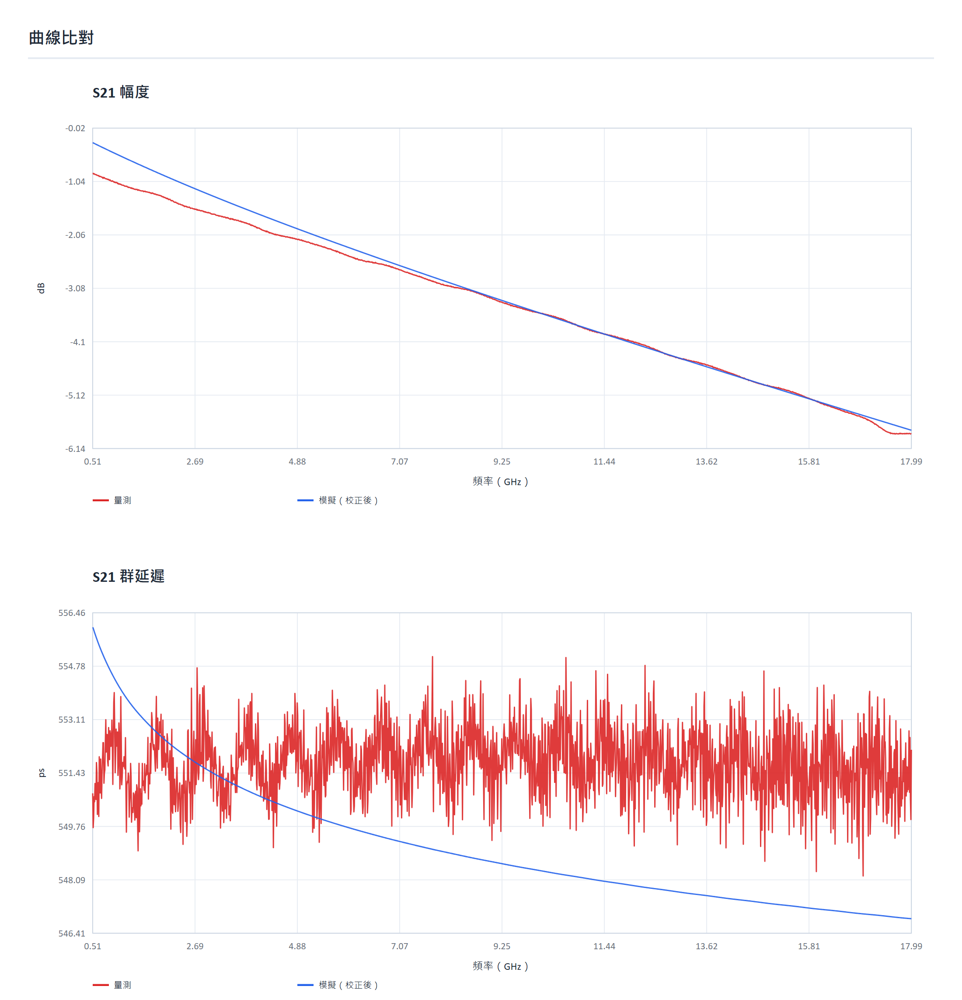
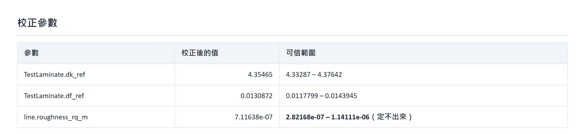

# Operation guide

Language: [繁體中文](../操作說明.md)｜[English](operation-en.md)
Back to: [README](../README.en.md)｜[Validation](validation.md)

> This repository contains the front-end source only. What follows describes the complete
> tool; the solver and diagnostics back end is private, so the front end alone cannot
> complete a calibration.

---

## Prerequisites

| Item | Purpose | Required |
|---|---|---|
| Python 3.10 or newer | Back end | Yes |
| Node.js 18 or newer | Building the web UI (first run only) | Yes |
| `numpy`, `scipy` | Numerics and optimization | Yes |
| `scikit-rf` | Touchstone I/O, reference-impedance renormalization | Yes |
| `scikit-learn` | Surrogate models and CoP | Yes |
| `fastapi`, `uvicorn`, `python-multipart` | Back-end service and file upload | Yes |
| `pyedb` | Reading a cross-section from layout (ODB++ / EDB) | Optional |
| Ansys Electronics Desktop | Provides the native EDB libraries; Q2D solving also needs a licence | Optional |

The browser opens at `http://127.0.0.1:8100`. If that port is busy the launcher shifts to
8101 or 8102.

---

## Compare mode

Two files and you are running.

1. Load the simulated and the measured response. Touchstone (`.s2p`, `.s4p`, …) and VNA CSV
   exports are supported.
2. Press Compare.

Pre-flight checks run first (port count, port order, reference impedance, band overlap,
passivity, reciprocity, low-frequency insertion-loss offset). Both responses are then aligned
onto a common frequency grid and overlaid in magnitude and group delay, with an RMS
difference.

> **A CSV frequency column must state its unit** (`Frequency(Hz)`, `Freq (GHz)`). This tool
> does not guess — guessing wrong shifts the whole result by an order of magnitude without
> raising anything.

---

## Calibration mode

| Step | Action | Note |
|---|---|---|
| 1 | Load the measurement | It should be a **uniform transmission line** (a calibration coupon). Back-solving material from a full channel with vias and corners is an ill-posed inverse problem |
| 2 | Enable Delta-L and load a second coupon | Strongly recommended. See below |
| 3 | Enter the cross-section | Stackup plus trace width is enough. **Choosing stripline where it is microstrip biases Dk high systematically** |
| 4 | Define calibration bands | Several bands, not necessarily contiguous — e.g. loss at low frequency, resonance at high frequency |
| 5 | Choose parameters and search ranges | |
| 6 | Start | |

The flow is: DOE sampling → surrogate fit → optimize on the response surface → adaptive
refinement → local polish on the real solver → verification solve → identifiability analysis.

---

## Delta-L: removing the fixture

If you have a pair of coupons with the **same cross-section and different lengths** (1 inch
and 3 inch, say), use this.

Tick "use Delta-L" and load the second coupon. The tool decides which one is the long line
**from group delay, not from the file name**, guesses the lengths from the file names for you
to confirm, then divides.

After the division **only S21 is meaningful**; putting S11 in a calibration band is rejected.
The cross-section length is locked to ΔL automatically.

| Guard | Criterion |
|---|---|
| Wrong length unit | Effective permittivity recovered from group delay, rejected outside 1–20 (entering mm as inch gives 0.15) |
| Inconsistent fixtures | Loss difference extrapolated to DC still shows a residue |
| Frequency sampling too coarse | Phase change between adjacent points exceeds π; group delay itself is then wrong |

---

## Reading the cross-section from layout

Trace width, length, copper thickness, stackup, Dk and Df are all in the layout already.
**Transcribing them by hand fails silently** — the curves still overlay, the answer is just
wrong. The easiest one to get wrong is the stripline plate separation b: the formula wants
the distance between the two reference planes, but the stackup table shows a single dielectric
layer thickness, and they differ by several times.

Enter the `.aedb` directory path in calibration mode and press Read nets. Every net with
traces is listed, with coupon-like nets first (single layer, has length, at most two vias).
Pick one, read its cross-section, apply it.

> Import ODB++ into `.aedb` in Ansys Electronics Desktop first. The translation options
> (units, layer mapping) affect every number downstream, and those choices belong to a person.

Dk and Df come back as **starting values**, not answers. Roughness is not imported: EDB stores
a Hall-Huray nodule radius while the analytical model here uses Hammerstad RMS roughness.
Different models; the numbers are not interchangeable.

---

## Cutout (optional)

Cuts the region around the coupon into a new `.aedb`. Measured on a real board with 308 nets
and 2667 primitives: 4 nets and 50 primitives remain (98.1% removed) in about 10 seconds.

**Cutout is not part of calibration.** Calibration runs on the analytical cross-section solver
and needs only the cross-section numbers. The cutout exists so you can take it into SIwave or
HFSS.

If the output directory already exists the tool refuses rather than overwriting silently.

---

## Reading the result

The report states **whether it can be trusted** before it states any number. There are three
verdicts:

| Verdict | Meaning |
|---|---|
| **Trustworthy** | No systematic error in the residual, every parameter identifiable |
| **Partially usable** | Nothing is wrong, but this measurement cannot support all the parameters — the report lists which ones may be adopted |
| **Not trustworthy** | The residual contains a systematic unexplained component |

| Diagnosis | Meaning | What to do |
|---|---|---|
| Residual has a fixed offset | Fixture or connector not de-embedded; Df is contaminated | De-embed, or switch to Delta-L |
| Residual is not a smooth shape | Resonance or impedance discontinuity, not a material problem | Check the geometry model (vias, layer changes, connectors) |
| A parameter is not identifiable | This measurement cannot support that many degrees of freedom | Widen the band, or fix one parameter (**Delta-L does not help here**) |
| A parameter pins at a search bound | The range may be too narrow | Normally, widen it and re-run. **Not when the residual diagnosis also reports a fixture** — the optimizer is using that parameter to store the fixture's frequency-independent loss, and it will take whatever room you give it (measured: widening took the roughness error from +118% to +355%). De-embed, or switch to Delta-L, first |
| The two models disagree | At least one model does not apply to this structure | Confirm both got the same stackup and geometry, then find which physics differs |
| Cross-validation did not finish | Requested, but the budget ran out | Raise the cross-validation solve budget and re-run. The verdict is "unknown" and the material library is not marked trustworthy |

**A clean residual does not mean the parameters are right.** Measured case: Df wrong by 34%
with a residual of only 0.046 dB, because the two parameter sets are indistinguishable in the
data. That is what identifiability analysis is for.

---

## Deliverables

| Output | Format | Use |
|---|---|---|
| Calibration report | HTML | Self-contained, opens offline, can be e-mailed |
| Material library | JSON | Causal dispersion model parameters, reusable on the next project |
| Dk/Df vs. frequency | CSV | Readable by anything |
| Raw DOE data set | — | Curves rather than cost values, so changing bands or weights recomputes without solving again |

A DOE data set also resumes after an interruption when the working directory is the same.

The material library carries the verdict with it. **A fixture-contaminated Df that reaches the
next project unlabelled turns this tool into the carrier of the contamination.**

---

## What the report looks like

All of these are real tool output, not mock-ups.

**Residual diagnosis** — the verdict rests on the **component decomposition**, not on how the
residual curve looks. This residual falls with frequency rather than being flat; it is called a
fixture because 1.1 dB of it is frequency-independent:

**Curve comparison** — above 9 GHz the two lie on top of each other; below 9 GHz there is a
visible gap. That gap is the fixture's 1 dB:

**Calibrated parameters** — each carries a confidence range, and an unidentifiable one is
labelled as such:

Screenshots of the interface itself are not included yet; they will be captured in the same
session as the demonstration video.
