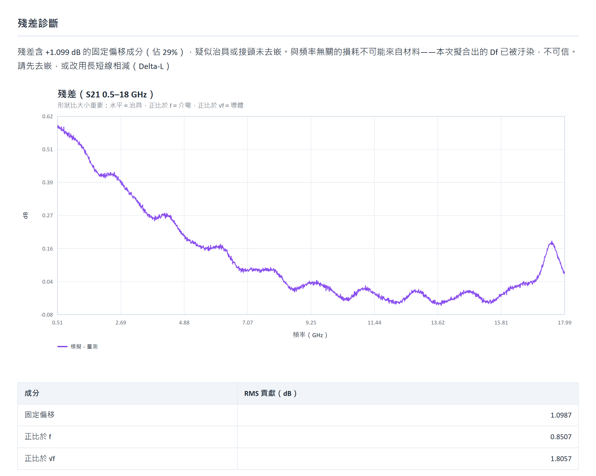

# 驗證報告 Validation report

語言：[繁體中文](validation.md)（本頁含英文摘要）
回到：[README 繁體中文](../README.zh-TW.md)｜[README English](../README.en.md)｜[操作說明](../操作說明.md)｜[Operation guide](operation-en.md)

---

## 為什麼這份驗證是這樣設計的

要證明一個校正工具有用，最沒有意義的做法是**用它自己的模型產生資料，再看它找不找得
回來**。那只證明最佳化器會收斂，不證明工具面對真實世界會不會亂講話。

所以測試資料刻意**不是**用校正模型做出來的：

| 成分 | 來源 |
|---|---|
| 真值響應 | **Ansys Q2D Extractor 二維場求解**——與校正用的解析模型是不同的方法 |
| 治具 | 0.55 dB 損耗、28 ps 延遲、8 Ω 阻抗失配 |
| VNA 雜訊 | −85 dB 雜訊底、0.004 dB 逐點雜訊 |
| 校準殘差 | 0.02 dB、週期 1.7 GHz 的漣波 |
| 接頭共振 | 17.5 GHz、−0.25 dB |
| 蝕刻角 | 12° |

量到的因此是**模型失配加雜訊**下的行為，而不是自己埋自己找。

### 真值

| 參數 | 真值 |
|---|---|
| Dk（1 GHz） | 4.2 |
| Df（1 GHz） | 0.0135 |
| 粗糙度 Rq | 0.55 µm |
| 截面 | stripline，線寬 150 µm、板厚 500 µm、銅厚 35 µm |
| 導電率 | 5.8×10⁷ S/m |
| 試片長度 | 25.4 mm 與 76.2 mm |
| 頻率 | 10 MHz – 20 GHz，2001 點 |

---

## 三個情境

| 情境 | 工具的結論 | Dk 誤差 | Df 誤差 |
|---|---|---|---|
| 直接校正長線（治具沒處理） | **不可信**（偵測到治具） | +14.29% | +6.50% |
| Delta-L 相減 | **部分可用**（粗糙度定不出來） | +3.68% | −3.06% |
| Delta-L ＋ 粗糙度固定 | **可信** | +3.80% | +1.22% |

三列都是**工具講對了**：

- 第一列有治具，工具說不可信——**它沒有把 0.55 dB 的接頭損耗當成材料損耗報出去**。
- 第二列沒有東西是錯的，但這組量測撐不起三個自由度。工具給的粗糙度範圍是
  0.282–1.141 µm，**真值 0.55 µm 就在裡面**。它誠實地說了這件事，而不是報一個好看的
  數字。
- 第三列把粗糙度固定成已知值之後，兩個參數都在 4% 以內，判定為可信。

「部分可用」不是失敗，是這個工具存在的理由之一。

### 可重現性

三個情境連跑兩次，參數、殘差與可辨識範圍**逐位元相同**。這件事要明講，因為
DOE 取樣與差分演化都用亂數——不釘住種子的話，同一份資料每次會給不同的答案，
而使用者看不出來哪一次該信。

### 直接校正長線那次的殘差長什麼樣

判定的依據是**成分分解**，不是殘差曲線的外觀。直接校正長線那次的分解是：

| 成分 | RMS 貢獻（dB） |
|---|---|
| 固定偏移 | 1.0987（佔 29%，觸發治具判定） |
| 正比於 f | 0.8507 |
| 正比於 √f | 1.8057 |

殘差本身**不是水平線**：它從低頻的 +0.6 dB 一路降到 10 GHz 之後的接近零，
末端 17.5 GHz 還有一個接頭共振造成的小峰。會被認定為治具的原因是「拆出來有
0.99–1.1 dB 與頻率完全無關」——與頻率無關的損耗不可能來自材料。

---

## Delta-L 對治具的效果

同一份含 0.6 dB 接頭損耗的資料：

| | Dk | Df | 診斷 |
|---|---|---|---|
| 直接校正長線 | +10.6% | +18.9% | 治具汙染，不可信 |
| 走 Delta-L | +0.02% | +0.56% | 乾淨，可信 |

**精度取決於試片的阻抗匹配。** 相除消掉治具的前提是治具與線之間沒有多重反射。實測
Z0 = 54.5 Ω 對 50 Ω 參考時，衰減常數誤差 0.75%；完全匹配時誤差是 1×10⁻¹⁴。

---

## 資訊量上限：Delta-L 解決不了可辨識性

直接計算精確成本函數在真值處的 Hessian，取條件數：

| 量測組態 | 條件數 |
|---|---|
| 1–20 GHz、單一線長 | 1244 |
| 1–20 GHz、兩種線長 | 1241 |
| 1–50 GHz、單一線長 | 389 |

均勻線的 S21(L) = exp(−γL)，兩個長度量到的是**同一個 γ 兩次**，不是兩條獨立的方程。
所以 Delta-L 消得掉治具，消不掉參數之間的糾纏。定不出來時要加寬頻段，或固定其中一個
參數。

---

## 求解器交叉驗證

同一批 Q2D 產生的資料、同一組設定，只換求解器：

| 求解器 | Dk | 殘差 | 工具的結論 |
|---|---|---|---|
| 解析截面 | 4.356（+3.7%） | 0.018 dB | 部分可用 |
| Q2D | **4.198（−0.04%）** | 0.015 dB | 部分可用 |

兩者殘差都乾淨、結論都一樣，**但 Dk 差了 3.7%**。那個差距是模型偏差——模型系統性偏離
真實物理時，偏差會被吸收進參數，而殘差看起來完全正常。只有換一個求解器才量得到。

### Q2D 求解器本身的驗證（2026-09-01，AEDT 2025.2）

| 比較項 | 差異 |
|---|---|
| 特徵阻抗 Z0 | 0.1% |
| 插入損耗 | 1.3%–3.6% |
| 一次求解 | 約 20 秒 |

這次驗證抓到解析模型的一個**真實物理錯誤**：帶線誤用了微帶線的導體損耗公式，把導體
損耗高估約三倍。Z0 兩者差 0.1%（幾何與介電常數都對），只有損耗對不上——**單獨看解析
模型是看不出來的，它自洽，只是不對。**

---

## 殘差乾淨不等於參數可信

實測過的案例：**Df 錯 34%，而殘差只有 0.046 dB**。原因是那兩組參數在該組資料上分不
出來。這是可辨識性分析存在的唯一理由，也是為什麼本工具的報告永遠先講可不可信、再講
數字。

---

## 自動化測試

| 範圍 | 項數 |
|---|---|
| 後端（pytest） | 157（其中 2 項需要 Ansys Electronics Desktop） |
| 前端（vitest） | 14 |

---

## English summary

The test data is deliberately **not** produced by the calibration model. Ground truth comes
from an Ansys Q2D Extractor 2-D field solve, with a fixture (0.55 dB loss, 28 ps delay, 8 Ω
mismatch), VNA noise, calibration ripple, a 17.5 GHz connector resonance and a 12° etch angle
added on top. True values: Dk 4.2, Df 0.0135 at 1 GHz, Rq 0.55 µm, stripline 150 µm wide in a
500 µm plate separation, 10 MHz–20 GHz over 2001 points.

Across three scenarios the tool is right every time: it refuses the fixture-contaminated case
instead of reporting the contaminated Df; it reports the Delta-L case as partially usable
because roughness is not identifiable, and the range it gives (0.282–1.141 µm) contains the
true 0.55 µm; and with roughness fixed it returns both parameters within 4% and calls the
result trustworthy.

Delta-L removes the fixture (+10.6%/+18.9% error becomes +0.02%/+0.56%) but does not improve
identifiability — the Hessian condition number is 1244 with one length and 1241 with two,
while widening the band to 1–50 GHz brings it to 389.

Running the analytical and Q2D solvers on identical data gives clean residuals and the same
verdict, yet Dk differs by 3.7%. That gap is model bias, measurable only with a second solver.
The Q2D cross-check itself agreed to 0.1% on Z0 and 1.3%–3.6% on insertion loss, and exposed a
real physics error in the analytical model: stripline was using the microstrip conductor-loss
formula, overestimating conductor loss roughly threefold.
